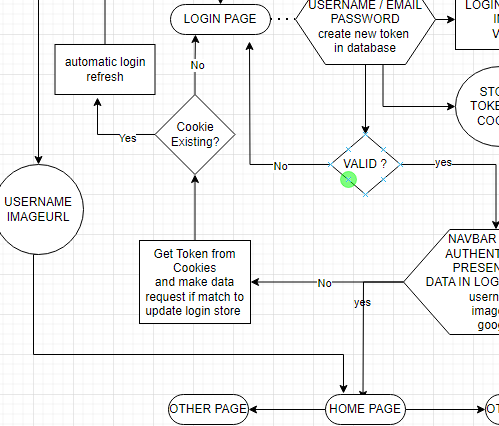

# React Redux Toolkit Login / Signup Authentication

Welcome to the project! This repository contains a React app for Login and Signup Authentication.

## Getting Started

Follow these steps to get the project up and running on your local machine:

1. Clone this repository.
2. Navigate to the project's root directory.
3. Install dependencies using `npm install`.
4. Start the development server with `npm start`.

## Usage

To use the app, follow these instructions:

<!--1. [Insert usage instructions here].
2. [More usage details, if needed].-->

## Contributing

We welcome contributions to the project. If you want to contribute, please follow these steps:

1. Fork the repository.
2. Create a new branch for your changes.
3. Make your changes and commit them with descriptive messages.
4. Push the changes to your forked repository.
5. Create a pull request to the main repository.

## License

This project is licensed under MIT-License. See [LICENSE](./LICENSE) for more details.

